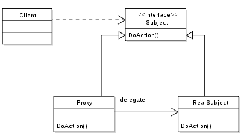

# 代理模式

代理，是一种设计模式，其通过hook实现类达到根据不同输入产出对应输出的目的。
一般代理可以分为`静态代理`和`动态代理`。

代理模式比较经典的实现有负载均衡、服务发现



## 静态代理

由Client实现RealSubject并传入Proxy

```Java
RealSubject subject = RealSubject();
Proxy proxy = Proxy(subject);
proxy.invoke();
```

没什么用

## 动态代理

由proxy类实现RealSubject，Client通过Subject进行调用

```Java
Proxy proxy = Proxy(Subject.javaClass);
proxy.invoke();
```

很容易想到这种实现方式符合C/S模式，是比较优雅的。
直接贴一段kotlin的实现：

```Kotlin
 val currentMyProxy: IMyProxy = Proxy.newProxyInstance(
            IMyProxy::class.java.classLoader,
            IMyProxy::class.java.interfaces,
            object : InvocationHandler{
                override fun invoke(proxy: Any?, method: Method, args: Array<out Any>?): Any? {
                    return if (args == null) {
                        method.invoke(myProxy)
                    } else {
                        method.invoke(myProxy, args)
                    }
                }
            }
        ) as IMyProxy
```