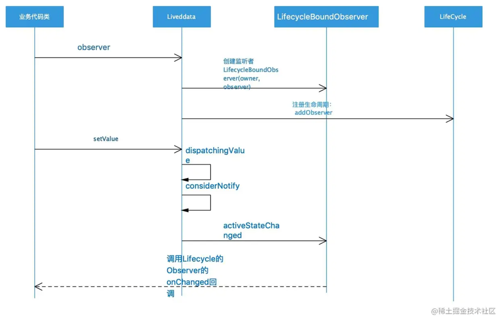

# MVVM

# 概念

MVVM又称Model-View-Binder，是一种基于数据驱动视图框架更新的架构类型。其中

- Model表示数据层，也叫状态内容的领域模型
- View表示视图层，也就是与用户进行交互的视图页面
- ViewModel表示视图模型层，将视图层与数据层进行绑定。需要指出的是这一层通常隐含在MVVM的基础框架中（并由其实现）

## DataBinding

一般没人用这玩意吧

## ViewModel

ViewModel负责维护页面数据&状态并进行流转，在Android的组件中一般涉及到下面几个

```kotlin
 by viewModels() //kotlin语法糖
 ViewModelProvider
 ViewModelStore、ViewModelStoreOwner
```

如果你熟悉Flutter的话会发现Flutter的Mobx框架和它很像

### ViewModelProvider
ViewModelProvider一般用于创建一个ViewModel对象出来
```kotlin
public ViewModelProvider(@NonNull ViewModelStore store, @NonNull Factory factory) {
    mFactory = factory;
    mViewModelStore = store;
}
```
大部分情况下factory是AndroidViewModelFactory.getInstance(application)，如果你需要初始化viewModel中的数据，可以自行实现Factory中的create函数

### ViewModelStore
viewModelStore持有一个视图结构中所有的viewModel，他其实就是个HashMap。

### ViewModelStoreOwner
从字面上比较容易理解，ViewModelStoreOwner表示的是持有viewModelStore的对象，在Activity和Fragment中这个对象分别是
- requireActivity().viewModelStore
- ownerProducer().viewModelStore // ownerProducer()一般就是this，也就是fragment自己

### 生命周期

viewModel组件的一个特点是他与LifeCycleOwner是绑定的，所以在Activity/Fragment被销毁时，viewModel也会被销毁
```kotlin
// Activity
getLifecycle().addObserver(new LifecycleEventObserver() {
    @Override
    public void onStateChanged(@NonNull LifecycleOwner source,
            @NonNull Lifecycle.Event event) {
        if (event == Lifecycle.Event.ON_DESTROY) {
            // Clear out the available context
            mContextAwareHelper.clearAvailableContext();
            // And clear the ViewModelStore
            if (!isChangingConfigurations()) {
                getViewModelStore().clear();
            }
        }
    }
});

// Fragment
void clearNonConfigState(@NonNull Fragment f) {
    ...
    ViewModelStore viewModelStore = mViewModelStores.get(f.mWho);
    if (viewModelStore != null) {
        viewModelStore.clear();
        mViewModelStores.remove(f.mWho);
    }
}
```

### 重建

在经典的横竖屏转换的过程中，Activity会发生重建，但其中会走如下的生命周期流程：
```kotlin

// Destory
--> ActivityThread#performDestory()
--> Activity#retainNonConfigurationInstances()
--> Activity#onRetainNonConfigurationInstance()
--> Activity#onDestory()

// attach
--> Activity#attach()
--> onCreate()

```

viewModel在Activity因配置变化导致重建时会被保留，
注意到有个isChangingConfigurations()
官方给的解释是在Activity发生旋转的过程中，viewModel是不会发生Clear的。

```kotlin
     /**
     * @return If the activity is being torn down in order to be recreated with a new configuration,
     * returns true; else returns false.
     **/
```

## LiveData

### 流程
> 
> 引用自 https://juejin.cn/post/6978312292999888933

liveData只在活跃态（STARTED RESUMED）能够主动通知

### LifecycleBoundObserver

LifecycleBoundObserver实现了ObserverWrapper以及LifecycleEventObserver

主要有以下几个关键接口：

- shouldBeActive: LiveData是否能够被响应
- onStateChanged: 在FragmentActivity or Fragment生命周期发生改变时主动调用
- detachObserver: remove掉observer
- activeStateChanged: 通知事件

