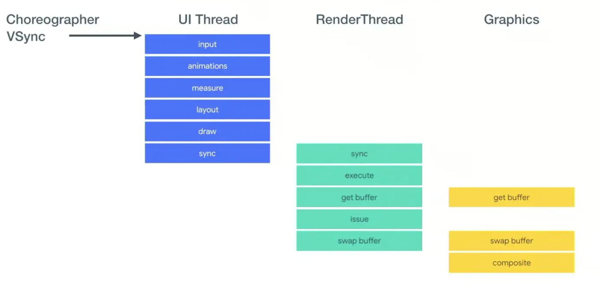

# Android Java层绘制

以下分析基于Android-28

## 从Resume说起

- ActivityThread.handleResumeActivity

我们主要关注onResume后面的流程，即从handleResumeActivity开始到`Activity.onResume`开始到scheduelTranslation的过程

这个阶段主要是关于WindowManager、Activity的操作
Activity中所有关于Window的操作都收敛在WindowManager上
所以这个阶段会调用`WindowManager.addView`将decorView给attach到window上

```kotlin
if (a.mVisibleFromClient) {
    if (!a.mWindowAdded) {
        a.mWindowAdded = true;
        wm.addView(decor, l);
    } else {
        // The activity will get a callback for this {@link LayoutParams} change
        // earlier. However, at that time the decor will not be set (this is set
        // in this method), so no action will be taken. This call ensures the
        // callback occurs with the decor set.
        a.onWindowAttributesChanged(l);
    }
}
```

- WindowManager.addView
这段代码实际上在`WindowManagerGlobal.addView`上，没啥好讲的，关键是初始化ViewRootImpl以及执行`ViewRootImpl.addView`。

- ViewRootImpl.setView
在初始化ViewRootImpl的时候会把`mAttachInfo`也给初始化好，这个在`View.dispatchAttachedToWindow`中会进行传递，里面就包括了初始化好的同一份ViewRootImpl。

说回addView，setView会首先进行一堆兼容模式，硬件加速的配置。
到

```kotlin
// view传递
mAttachInfo.mRootView = view;
mAttachInfo.mScalingRequired = mTranslator != null;
mAttachInfo.mApplicationScale =
        mTranslator == null ? 1.0f : mTranslator.applicationScale;
if (panelParentView != null) {
    mAttachInfo.mPanelParentWindowToken
            = panelParentView.getApplicationWindowToken();
}
mAdded = true;
```

代表add工作已经做好了，然后调用requestLayout，这一步会多检察一下createView和当前request的线程是不是同一个线程（理论上都在主线程）
到scheduleTraversals

- ViewRootImpl

```kotlin
void scheduleTraversals() {
    if (!mTraversalScheduled) {
        mTraversalScheduled = true;
        mTraversalBarrier = mHandler.getLooper().getQueue().postSyncBarrier();
        mChoreographer.postCallback(
                Choreographer.CALLBACK_TRAVERSAL, mTraversalRunnable, null);
        if (!mUnbufferedInputDispatch) {
            scheduleConsumeBatchedInput();
        }
        notifyRendererOfFramePending();
        pokeDrawLockIfNeeded();
    }
}
```
这里会先用postSyncBarrier为ViewRootImpl内部线程插个队，然后向Choreographer去post一个`CALLBACK_TRAVERSAL`任务流程，插入到Chorgrapher的mCallbackQueue中立刻doScheduleVsync，然后Choregrapher就开始工作了。

## Choregrapher



他是一个调度器，用于协调四种指定的CallBack流程:
- CALLBACK_INPUT：手势输入之类的
- CALLBACK_ANIMATION：和Animation处理有关
- CALLBACK_TRAVERSAL：UI绘制流程measure、layout、draw
- CALLBACK_COMMIT：提交任务
在VSYNC信号到来的时候去处理这些任务

首先看一下Choreographer的初始化：

```kotlin
private Choreographer(Looper looper, int vsyncSource) {
    mLooper = looper;
    // 创建自己的handler
    // 处理三种MSG：
    // - MSG_DO_FRAME
    // - MSG_DO_SCHEDULE_VSYNC
    // - MSG_DO_SCHEDULE_CALLBACK
    // 绑定Looper（线程）
    mHandler = new FrameHandler(looper);
    // 用于接收native Vsync信号
    mDisplayEventReceiver = USE_VSYNC
            ? new FrameDisplayEventReceiver(looper, vsyncSource)
            : null;
    
    // 一些帧计时操作，用于去校验是否存在丢帧，逆转帧之类的
    mLastFrameTimeNanos = Long.MIN_VALUE;

    mFrameIntervalNanos = (long)(1000000000 / getRefreshRate());

    mCallbackQueues = new CallbackQueue[CALLBACK_LAST + 1];
    for (int i = 0; i <= CALLBACK_LAST; i++) {
        mCallbackQueues[i] = new CallbackQueue();
    }
    // b/68769804: For low FPS experiments.
    setFPSDivisor(SystemProperties.getInt(ThreadedRenderer.DEBUG_FPS_DIVISOR, 1));
}
```

Choreographer的核心流程是doFrame，这个方法用于触发CallBack任务以及将绘制工作组装交给RenderThread，我们先看一下他是如何被触发的：

- Vsync
这个是由native信号触发的，核心listener在`mDisplayEventReceiver`中，Vsync信号来临是，会触发`onVsync`回调。

经过一些校验后，这个runnable把自己post到主流程中（他的run其实也是doFrame），等到`timestampNanos / TimeUtils.NANOS_PER_MS`这个时间执行

```kotlin
    Message msg = Message.obtain(mHandler, this);
    msg.setAsynchronous(true);
    mHandler.sendMessageAtTime(msg, timestampNanos / TimeUtils.NANOS_PER_MS);
```

- app行为触发
app有一些行为可以触发页面更新，比如点击事件、动画、invalidate之类的（和上面的CALLBACK一一对应）
这里我们拿`ViewRootImpl.scheduleTraversals`讨论一下，先上一张参考图


上文提到我们的scheduleTraversals post了一个`CALLBACK_TRAVERSAL`过来，最终走到了scheduleVsyncLocked中，触发了一次vsync，然后重新走到onVsync流程中。

好我们来到最关键的doFrame，它实际上也是完成了一个调度工作：

首先它先校验了一下jank情况（就是你可能会skip掉几帧）、逆转帧等等，校验完成后会记录当次的状态：

```kotlin
    mFrameInfo.setVsync(intendedFrameTimeNanos, frameTimeNanos);
    mFrameScheduled = false;
    mLastFrameTimeNanos = frameTimeNanos;
```

然后按照CALLBACK优先级去处理不同postCallback塞入Queue的任务（甚至还贴心的加了个锁）

```kotlin
    try {
        Trace.traceBegin(Trace.TRACE_TAG_VIEW, "Choreographer#doFrame");
        AnimationUtils.lockAnimationClock(frameTimeNanos / TimeUtils.NANOS_PER_MS);

        mFrameInfo.markInputHandlingStart();
        doCallbacks(Choreographer.CALLBACK_INPUT, frameTimeNanos);

        mFrameInfo.markAnimationsStart();
        doCallbacks(Choreographer.CALLBACK_ANIMATION, frameTimeNanos);

        mFrameInfo.markPerformTraversalsStart();
        doCallbacks(Choreographer.CALLBACK_TRAVERSAL, frameTimeNanos);

        doCallbacks(Choreographer.CALLBACK_COMMIT, frameTimeNanos);
    } finally {
        AnimationUtils.unlockAnimationClock();
        Trace.traceEnd(Trace.TRACE_TAG_VIEW);
    }
```

Choreographer的整体工作流程就是这样。我们会发现他其实并没有什么绘制指令，只是负责把绘制任务调度起来，将绘制任务下放到各个postCallback的地方，提升了扩展性，也避免其他绘制地方需要直接调用到display或者SurfaceFlinger的问题。

可是这样做还是没有把内容画在屏幕上呀？

## 回到ViewRootImpl

上文提到了渲染流程的调度，但也仅仅是调度，渲染结果是怎么真正显示到屏幕上的呢？

答案就在ViewRootImpl中，还记得我们注入了一个`CALLBACK_TRAVERSAL`，和这个Callback一起注入的还有一个回调`mTraversalRunnable`，这个runnable只有一句

```kotlin
final class TraversalRunnable implements Runnable {
    @Override
    public void run() {
        doTraversal();
    }
}
// 又是一个插队！
void doTraversal() {
    if (mTraversalScheduled) {
        mTraversalScheduled = false;
        mHandler.getLooper().getQueue().removeSyncBarrier(mTraversalBarrier);

        if (mProfile) {
            Debug.startMethodTracing("ViewAncestor");
        }

        performTraversals();

        if (mProfile) {
            Debug.stopMethodTracing();
            mProfile = false;
        }
    }
}
```

然后走到performTraversals中（这玩意有900+行代码，以后再细看），核心关键在于一堆perform，比如performMeasure，performLayout和performDraw。

我们这里主要关心performDraw，他最终会走到draw中

```kotlin
if (!dirty.isEmpty() || mIsAnimating || accessibilityFocusDirty) {
    if (mAttachInfo.mThreadedRenderer != null && mAttachInfo.mThreadedRenderer.isEnabled()) {
        ...
        mAttachInfo.mThreadedRenderer.draw(mView, mAttachInfo, this, callback);
    } else {
        // If we get here with a disabled & requested hardware renderer, something went
        // wrong (an invalidate posted right before we destroyed the hardware surface
        // for instance) so we should just bail out. Locking the surface with software
        // rendering at this point would lock it forever and prevent hardware renderer
        // from doing its job when it comes back.
        // Before we request a new frame we must however attempt to reinitiliaze the
        // hardware renderer if it's in requested state. This would happen after an
        // eglTerminate() for instance.
        if (mAttachInfo.mThreadedRenderer != null &&
                !mAttachInfo.mThreadedRenderer.isEnabled() &&
                mAttachInfo.mThreadedRenderer.isRequested() &&
                mSurface.isValid()) {
            ...
            // 如果寄了就schedule到下一帧
            scheduleTraversals();
            return false;
        }
        // 要不然就自己画
        if (!drawSoftware(surface, mAttachInfo, xOffset, yOffset,
                scalingRequired, dirty, surfaceInsets)) {
            return false;
        }
    }
    // 再次贴心
    if (animating) {
        mFullRedrawNeeded = true;
        scheduleTraversals();
    }
}
```

以`mAttachInfo.mThreadedRenderer.draw`举例，我们将渲染绘制流程交给Renderer，由renderer操作renderNode进行真正的渲染，到此Java部分的渲染就串起来了，接下来就需要进入native渲染。

```kotlin
void draw(View view, AttachInfo attachInfo, DrawCallbacks callbacks,
        FrameDrawingCallback frameDrawingCallback) {
    attachInfo.mIgnoreDirtyState = true;

    final Choreographer choreographer = attachInfo.mViewRootImpl.mChoreographer;
    choreographer.mFrameInfo.markDrawStart();

    updateRootDisplayList(view, callbacks);

    attachInfo.mIgnoreDirtyState = false;

    // register animating rendernodes which started animating prior to renderer
    // creation, which is typical for animators started prior to first draw
    if (attachInfo.mPendingAnimatingRenderNodes != null) {
        final int count = attachInfo.mPendingAnimatingRenderNodes.size();
        for (int i = 0; i < count; i++) {
            registerAnimatingRenderNode(
                    attachInfo.mPendingAnimatingRenderNodes.get(i));
        }
        attachInfo.mPendingAnimatingRenderNodes.clear();
        // We don't need this anymore as subsequent calls to
        // ViewRootImpl#attachRenderNodeAnimator will go directly to us.
        attachInfo.mPendingAnimatingRenderNodes = null;
    }

    final long[] frameInfo = choreographer.mFrameInfo.mFrameInfo;
    if (frameDrawingCallback != null) {
        nSetFrameCallback(mNativeProxy, frameDrawingCallback);
    }
    int syncResult = nSyncAndDrawFrame(mNativeProxy, frameInfo, frameInfo.length);
    if ((syncResult & SYNC_LOST_SURFACE_REWARD_IF_FOUND) != 0) {
        setEnabled(false);
        attachInfo.mViewRootImpl.mSurface.release();
        // Invalidate since we failed to draw. This should fetch a Surface
        // if it is still needed or do nothing if we are no longer drawing
        attachInfo.mViewRootImpl.invalidate();
    }
    if ((syncResult & SYNC_INVALIDATE_REQUIRED) != 0) {
        attachInfo.mViewRootImpl.invalidate();
    }
}

```