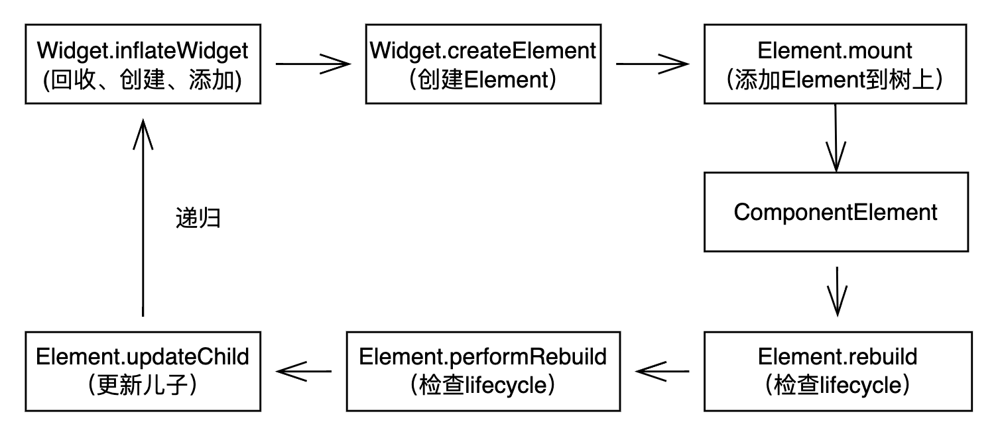

# Flutter Display

## 1 Widget、Element、RenderObject

Flutter的核心渲染思路是通过构造ElementTree，并将Element与RenderObject绑定起来，在skia引擎中完成绘制后，交给FlutterEngine进行绘制。

### 1.1 Widget

Widget Tree是ElementTree的一种映射。一般常用的是StatelessWidget、StatefulWidget。

- Widget build() {}

build方法返回值是Widget，一般用于inflateWidget流程之后

### 1.2 Element

> Element就是Widget在UI树具体位置的一个实例化对象
>
> ——[《Flutter实战》](https://book.flutterchina.club/chapter14/element_buildcontext.html#_14-2-1-element)

Element Tree的每一个节点都表示一个Widget，可以说ElementTree是由Widget Tree生成

### 1.3 RenderObject

> RenderObject就是渲染树中的一个对象，它主要的作用是实现事件响应以及渲染管线中除过 build 的部分（build 部分由 element 实现），即包括：布局、绘制、层合成以及上屏，这些我们将在后面章节介绍。
>
> ——[《Flutter实战》](https://book.flutterchina.club/chapter14/element_buildcontext.html#_14-2-1-element)


## 2 Flutter渲染流程

Flutter渲染的思想是由Element Tree生成RenderObject Tree，由RenderObject完成渲染流程。

这间接代表着，通过Element Tree并不能拿到RenderObject Tree的一些渲染信息，这也天生导致了Flutter在进入drawFrame之后，无法获取某个Element的渲染状态，相较于Native，少了比较多的信息回调。

我们先来说说Element Tree的构造流程：

### 2.1 Element Tree

**Build Phrase**



这张图里描述了Element Tree是如何基于Widget被构造出来的

**Update Phrase**

并不是所有的Element节点每次都需要重走一遍rebuild流程，因此对于已经有inactivate List中已存在的Widget，inflateWidget会进行一次回收，然后直接更新它的child


对于updateChild，也是有一些讲究的

```Dart
static bool canUpdate(Widget oldWidget, Widget newWidget) {
    return oldWidget.runtimeType == newWidget.runtimeType
        && oldWidget.key == newWidget.key;
}

/// 如果是恒等
if (hasSameSuperclass && child.widget == newWidget) {
    if (child.slot != newSlot)
        updateSlotForChild(child, newSlot);
    newChild = child;
/// 如果满足更新条件，见上方
} else if (hasSameSuperclass && Widget.canUpdate(child.widget, newWidget)) {
    if (child.slot != newSlot)
        updateSlotForChild(child, newSlot);
    // 调用Element
    child.update(newWidget);
    assert(child.widget == newWidget);
    assert(() {
        child.owner!._debugElementWasRebuilt(child);
        return true;
    }());
    newChild = child;
/// 纯纯的新Widget
} else {
    deactivateChild(child);
    assert(child._parent == null);
    newChild = inflateWidget(newWidget, newSlot);
}
```

**Delete 流程**

//TODO

### 2.2 RenderObjectElement

**Build Phrase**


**Update Phrase**


## 3 绘制流程

### 3.1 Collect Elements

绘制流程中比较关键问题是Element来源，从第二章可以看出，Element的来源有两种：
- createElement、mount：新建&挂载
- _dirtyElements：通过`scheduleBuildFor`触发，而`scheduleBuildFor`调用时机有两种:
  - activate：来自于inflateWidget时，由`_retakeInactiveElement`获取被inactivate的Widget，重复利用
  - markNeedsBuild

### 3.2 绘制流程

绘制过程指的是当前一次的Frame如何更新。我们知道Element Tree包含了整个page的element，如何保证本次的绘制不会重绘整个页面呢？答案就是3.1节中收集到的所有Element,下面讲述的就是基于这些Element的绘制流程，包括：

- 在`ScheduleFrame`时注册`onBeginFrame`(由Vsync信号触发)、`onDrawFrame`到window上

- 将drawFrame作为callBack加入`_persistentCallbacks`中去，等待FlutterEngine调用`onBeginFrame`和`onDrawFrame`时，调用`RenderBinding.drawFrame()`

- drawFrame会对三棵树逐个进行更新，分别涉及：
  - `BuildScope`:根据_dirtyElements更新ElementTree的
  - `flushLayout`:重新布局layoutTree，向下传递constraints，向上传递size（这里没仔细看）
  - `flushPaint`:根据`flushLayout`获得的`isRepaintBoundary`为True的节点进行绘制，并存储到Layer中（这里没仔细看）
  - `renderView.compositeFrame`:将绘制信息提交到FlutterEngine

tips
这里特殊提一下warmupFrame:

```Dart
/// Schedule a frame to run as soon as possible, rather than waiting for
/// the engine to request a frame in response to a system "Vsync" signal.
///
/// This is used during application startup so that the first frame (which is
/// likely to be quite expensive) gets a few extra milliseconds to run.
///
/// Locks events dispatching until the scheduled frame has completed.
void scheduleWarmUpFrame(){
    // flutter通过scheduleFrame手动请求一帧
    // 所以能看到_handleBeginFrame和_handleDrawFrame中会有一些类似于锁标志位的操作
}
void _handleBeginFrame(Duration rawTimeStamp) {
    // 锁
    if (_warmUpFrame) {
        assert(!_rescheduleAfterWarmUpFrame);
        _rescheduleAfterWarmUpFrame = true;
        return;
    }
    handleBeginFrame(rawTimeStamp);
}

void _handleDrawFrame() {
    // 锁
    if (_rescheduleAfterWarmUpFrame) {
        _rescheduleAfterWarmUpFrame = false;
        addPostFrameCallback((Duration timeStamp) {
            _hasScheduledFrame = false;
            scheduleFrame();
        });
        return;
    }
    handleDrawFrame();
}
```

这个执行可以由以下几种途径触发：

**Vsync信号**

Vsync信号直接触发`_handleBeginFrame`

**setState**

setState触发markNeedsBuild到SchculeFrame一整套流程