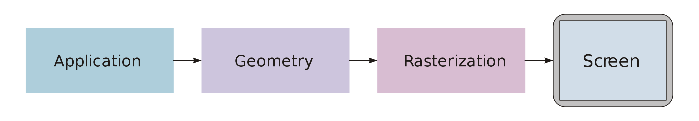
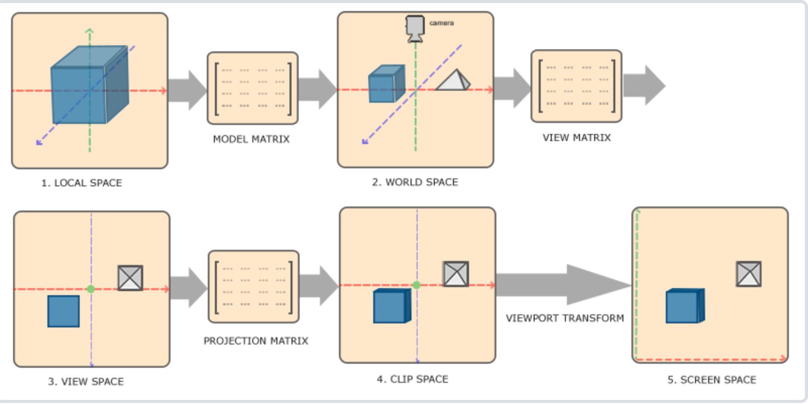

# 《一篇计算机渲染的综述》

## Advice From ChatGPT

如果您要写一篇关于渲染引擎的综述，我可以提供一些建议。

　　首先，可以概述渲染引擎的定义和用途，解释它是如何处理3D图形并将它们转换为二维图像的。这部分应该提供读者对渲染引擎有个初步的了解。

　　然后，可以深入讨论渲染引擎的工作原理，包括它包含的主要组件、渲染流程和优化技术。这部分应该提供对渲染引擎的内部工作机制的更深入的了解。

　　接下来，可以介绍常见的渲染引擎，包括它们的特点、应用领域和主要优势。这部分应该帮助读者了解当前市场上可用的渲染引擎，并便于比较不同渲染引擎之间的区别。

　　最后，可以总结渲染引擎的未来趋势，并讨论它们在游戏、动画和可视化领域的应用前景。这部分应该让读者对渲染引擎的未来发展有个大致的了解，并帮助读者预测渲染引擎的未来发展方向。

## Background

### 什么是“计算机渲染”

计算机渲染（Computer-Rendering）是一种将2D或者3D model转化为PBR（Physical Based Rendering）或non-PBR的技术手段。具体而言，其主要分为三步：

- 构造一个描述物体的Model

- 通过程序将其转化成计算机对象

- 通过渲染引擎将该对象渲染到计算机界面中

计算机渲染技术主要运用在各种需要可视化中：

- 场景建模：[写实小区还原](https://www.bilibili.com/video/BV1hP4y1q7LR)[1]

- 游戏开发：《原神》

- 3D场景采集：临选

- VR视频、直播、特效：抖音，vtuber

计算机渲染相关的职业主要是：

- 技术美术师(TA)：负责将UI/UE的稿件转化为程序可识别的Model

- 游戏开发(RD)：编写与引擎交互的程序，使其可以顺利渲染Model

### 计算机渲染主要的技术

计算机渲染技术核心是渲染引擎（我们对这部分更感兴趣）。它是一种用于处理并优化渲染图形的软件，主要用于游戏、动画和可视化领域，其作用是创建美丽和高度可交互的3D场景。

渲染引擎的一般工作步骤主要有：

- 对3D场景进行建模，包括每个物体的形状、材质和位置。

- 使用图形API将3D模型转换为图形命令，并将它们发送到操作系统。

- 操作系统接收图形命令并将它们转换为特定于硬件的指令，并通过图形处理器来执行。

- 图形处理器执行指令，并将3D模型渲染为二维图像。

- 二维图像被传送到显示器，并显示在用户面前。

为了完成这些工作，渲染引擎中通常包含以下核心模块：

- 渲染器：这是核心部分，用于处理图形渲染，包括光照、材质和阴影。

- 图形API：这是渲染器的基础，用于向操作系统发送图形命令。常见的图形API包括DirectX和OpenGL。

- 资源管理器：这部分负责管理游戏或应用程序中使用的所有资源，包括3D模型、纹理和声音。

- 场景管理器：它负责管理游戏或应用程序中的场景，包括物体的位置和相互作用。

- 物理引擎：它负责处理游戏或应用程序中的物理效果，包括重力、碰撞和弹性。

### 渲染引擎的工作原理

渲染管线（Graphics Pipeline）的主要工作流程可以分为以下三个步骤

Application阶段

该阶段内通常会发生物体、场景、摄像机的[变换](../base-render/base-knowledge/transform.md)，在变换时，我们需要手动设置一些变换参数，然后将渲染指令提交给渲染引擎，表示我们准备开始进行一轮全新的渲染。

Geometry阶段

该阶段主要是将Model转化为引擎空间坐标(World Coordinate)并进行光照处理

转换阶段主要如下图所示[2]

其大致分为

- 物体坐标 to 世界坐标(World Coordinate)
- 世界坐标 to 视口坐标(Viewport Coordinate)
- 视口坐标 to 裁剪坐标(Clip Coordinate)
- 裁剪坐标 to 屏幕坐标(Screen Coordinate)

光照处理，不同的渲染管线对光照的处理有所不同，所需的时间复杂度、空间复杂度也不尽相同。前向渲染(Forward-Rendering)采用的是使用所有光源对所有物体进行处理

Rasterization阶段

该阶段主要是将当前视口对应的Object转化为屏幕图片，即光栅化

## ForSeen

## Reference

[1]UE5写实小区场景制作展示，https://www.bilibili.com/video/BV1hP4y1q7LR

[2]坐标系统, https://learnopengl-cn.github.io/01%20Getting%20started/08%20Coordinate%20Systems/